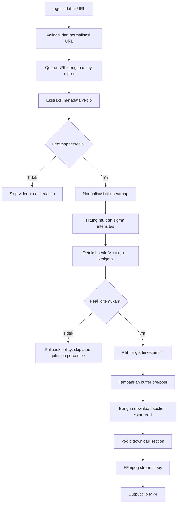

# YouTube Heatmap Automated Clipping Pipeline

Pipeline Python untuk menerima daftar URL YouTube, membaca metadata `yt-dlp` di memori, mendeteksi titik retensi penonton tertinggi dari data heatmap/`most replayed`, lalu mengunduh hanya segmen target memakai FFmpeg stream copy melalui `yt-dlp --download-sections` tanpa mengunduh video penuh.

## Ringkasan Teknis

- **Input**: daftar URL video YouTube.
- **Metadata extractor**: `yt-dlp` Python API dengan `download=False`.
- **Signal source**: objek heatmap dari metadata video, biasanya tersedia sebagai `heatmap` pada chapter/metadata YouTube yang diekstrak `yt-dlp`.
- **Peak detector**: deteksi lonjakan statistik berbasis rata-rata dan simpangan baku, bukan sekadar nilai absolut tertinggi.
- **Clipper**: `yt-dlp` dengan `download_sections` / `--download-sections` agar hanya range waktu tertentu yang diminta dan dipotong.
- **Media mode**: stream copy/raw segment; tidak re-encode.
- **Codec target**: MP4 dengan video H.264 dan audio AAC/M4A bila tersedia.

## 1. Arsitektur Pipeline

### Flowchart Eksekusi



### Logika Eksekusi

1. **Ingesti URL**
   - Sistem menerima URL dari file, argumen CLI, API, atau queue.
   - URL dinormalisasi dan dideduplikasi sebelum diproses.
   - Tiap URL diproses secara terkontrol agar tidak memicu rate limit.

2. **Ekstraksi Metadata**
   - Pipeline memakai `yt-dlp.YoutubeDL.extract_info(url, download=False)`.
   - Mode ini hanya mengambil metadata; file video tidak diunduh.
   - Metadata yang dibutuhkan: durasi, judul, id video, format, dan objek heatmap.

3. **Perhitungan Puncak Heatmap**
   - Data heatmap diekstrak sebagai deret titik waktu dan intensitas.
   - Sistem menghitung statistik global intensitas: rata-rata dan simpangan baku.
   - Titik dianggap peak bila melewati ambang statistik terkonfigurasi.

4. **Negosiasi Jaringan dan Pemotongan**
   - Setelah timestamp target ditentukan, sistem membuat section `*t_start-t_end`.
   - `yt-dlp` menegosiasikan request media hanya untuk rentang tersebut bila server dan format mendukung.
   - FFmpeg dipanggil oleh `yt-dlp` untuk memotong stream tanpa re-encoding.

## 2. Algoritma Deteksi Puncak

Sistem tidak boleh hanya memilih nilai intensitas tertinggi absolut. Nilai tertinggi absolut rentan terhadap noise, spike sempit, atau artefak metadata. Karena itu, pipeline memakai ambang statistik berbasis distribusi intensitas heatmap.

Untuk sekumpulan intensitas heatmap:

```text
values = [V1, V2, V3, ..., Vn]
```

Hitung rata-rata:

$$
\mu = \frac{1}{n}\sum_{i=1}^{n}V_i
$$

Hitung simpangan baku populasi:

$$
\sigma = \sqrt{\frac{1}{n}\sum_{i=1}^{n}(V_i - \mu)^2}
$$

Sebuah titik dengan intensitas `V` dianggap sebagai puncak bila:

$$
V \ge \mu + (k \times \sigma)
$$

Dengan:

- `V`: intensitas titik heatmap.
- `mu`: rata-rata intensitas heatmap.
- `sigma`: simpangan baku intensitas heatmap.
- `k`: sensitivitas peak detector, default `1.5`.

### Dampak Nilai `k`

- `k < 1.5`: lebih sensitif, lebih banyak kandidat peak, potensi false positive lebih tinggi.
- `k = 1.5`: default seimbang untuk menemukan replay spike yang cukup menonjol.
- `k > 1.5`: lebih konservatif, hanya spike kuat yang lolos.

### Seleksi Timestamp Target

Jika beberapa titik memenuhi ambang:

1. Urutkan kandidat berdasarkan intensitas tertinggi.
2. Buat clip untuk setiap kandidat puncak yang lolos ambang.
3. Tambahkan suffix `peakNN` pada nama file agar banyak clip dari video yang sama tidak saling menimpa.

Jika tidak ada titik yang memenuhi ambang, default aman adalah **skip video** dan catat `NO_HEATMAP_PEAK`. Fallback seperti top percentile dapat ditambahkan, tetapi harus eksplisit agar tidak menurunkan kualitas sinyal.

## 3. Mitigasi Keyframe Snapping dan Buffer Margin

Pipeline memakai stream copy murni tanpa re-encoding. Konsekuensinya, FFmpeg tidak dapat memotong secara frame-perfect pada timestamp arbitrary. Pemotongan akan mengikuti I-frame/keyframe terdekat karena hanya keyframe yang dapat menjadi titik decode mandiri.

Dampak praktis:

- Awal clip dapat bergeser ke keyframe sebelum/terdekat.
- Segmen bisa kehilangan konteks jika timestamp terlalu presisi.
- Hasil lebih cepat dan lossless, tetapi tidak frame-accurate seperti re-encoding.

Untuk mengurangi risiko puncak heatmap terpotong, sistem wajib menambahkan buffer matematis ke timestamp target `T`.

Default buffer:

- $\Delta t_{pre}$ = `10` detik.
- $\Delta t_{post}$ = `15` detik.

Rumus:

$$
t_{start} = \max(0, T - \Delta t_{pre})
$$

$$
t_{end} = T + \Delta t_{post}
$$

Jika durasi video diketahui, `t_end` sebaiknya dibatasi:

$$
t_{end} = \min(duration, T + \Delta t_{post})
$$

Contoh:

```text
T = 125.0
pre_margin = 10
post_margin = 15

t_start = max(0, 125.0 - 10) = 115.0
t_end = 125.0 + 15 = 140.0
section = *115.0-140.0
```

## 4. Penyeragaman Codec dan Parameter yt-dlp

Agar FFmpeg tidak melakukan silent re-encoding saat menggabungkan audio dan video, pipeline harus memilih format yang kompatibel dengan container MP4. Parameter format wajib:

```python
"format": "bestvideo[vcodec^=avc1][ext=mp4]+bestaudio[acodec^=mp4a][ext=m4a]/best[vcodec^=avc1][acodec^=mp4a][ext=mp4]"
```

Makna prioritas format:

1. `bestvideo[vcodec^=avc1][ext=mp4]+bestaudio[acodec^=mp4a][ext=m4a]`: pilih video H.264/AVC dan audio AAC/M4A terbaik, lalu mux ke MP4.
2. `best[vcodec^=avc1][acodec^=mp4a][ext=mp4]`: fallback ke stream progresif MP4 H.264/AAC.
3. Jika tidak tersedia, sistem gagal eksplisit agar tidak diam-diam memakai AV1/VP9 atau format non-target.

Konfigurasi `yt-dlp` yang direkomendasikan:

```python
ydl_opts = {
    "format": "bestvideo[vcodec^=avc1][ext=mp4]+bestaudio[acodec^=mp4a][ext=m4a]/best[vcodec^=avc1][acodec^=mp4a][ext=mp4]",
    "merge_output_format": "mp4",
    "outtmpl": "clips/%(id)s_%(title).80s_peak01.%(ext)s",
    "download_sections": ["*115.0-140.0"],
    "force_keyframes_at_cuts": False,
    "postprocessor_args": {
        "ffmpeg": ["-c", "copy"]
    },
}
```

Catatan:

- `-c copy` menjaga audio/video tetap stream copy.
- `merge_output_format=mp4` menyeragamkan output container.
- `force_keyframes_at_cuts=False` menjaga sistem tidak meminta re-encoding untuk presisi keyframe baru.
- Fallback `best` sengaja tidak dipakai agar output tidak diam-diam berubah ke AV1/VP9 atau container non-target.

## 5. Penanganan Pengecualian

### Heatmap Tidak Tersedia

Tidak semua video YouTube memiliki data `most replayed`. Metadata heatmap bisa tidak ada, kosong, atau bernilai `None`.

Respons sistem:

- Bungkus ekstraksi heatmap dalam `try-except`.
- Validasi key sebelum dipakai.
- Jika heatmap `None` atau kosong, skip video.
- Catat status `NO_HEATMAP_DATA` beserta URL dan video id bila tersedia.

Contoh kebijakan:

```text
NO_HEATMAP_DATA -> skip, no download, continue next URL
MALFORMED_HEATMAP -> skip, log parse failure, continue next URL
NO_HEATMAP_PEAK -> skip or configured fallback, continue next URL
```

### HTTP 429 dan Rate Limit

YouTube dapat membatasi request bila pipeline memproses banyak URL terlalu cepat. Sistem harus memiliki delay dan jitter pada antrean URL.

Strategi:

- Tambahkan delay dasar antar URL, misalnya `3-8` detik.
- Tambahkan jitter acak, misalnya `0-4` detik.
- Gunakan exponential backoff saat mendeteksi HTTP `429` atau error throttling.
- Batasi concurrency; default aman adalah serial atau concurrency rendah.
- Simpan checkpoint agar job bisa dilanjutkan tanpa mengulang URL sukses.

Contoh formula delay:

```text
sleep_seconds = base_delay + random.uniform(0, jitter_seconds)
```

### Error Handling Matrix

| Kondisi | Deteksi | Respons |
|---|---|---|
| Heatmap `None` | key tidak ada / nilai `None` | skip + log `NO_HEATMAP_DATA` |
| Heatmap kosong | list kosong | skip + log `NO_HEATMAP_DATA` |
| Heatmap malformed | field waktu/intensitas tidak valid | skip + log `MALFORMED_HEATMAP` |
| Tidak ada peak | tidak ada `V >= mu + k*sigma` | skip + log `NO_HEATMAP_PEAK` |
| HTTP 429 | exception yt-dlp / response code | backoff + retry terbatas |
| FFmpeg gagal copy | postprocessor error | log `CLIP_FAILED`, jangan retry tanpa perubahan format |
| Output sudah ada | path exists | skip atau overwrite sesuai config |

## Boilerplate Python

Lihat implementasi awal di [`heatmap_pipeline.py`](heatmap_pipeline.py). Kode tersebut merangkum dua kelas utama:

- `HeatmapExtractor`: mengambil metadata, mengekstrak heatmap, menghitung peak statistik.
- `VideoClipper`: membangun section dengan buffer dan mengunduh clip memakai `yt-dlp` + FFmpeg stream copy.
- CLI: menerima URL langsung atau file input, lalu mencetak status teks atau JSON untuk integrasi dashboard di masa depan.

### Contoh Penggunaan

CLI satu URL:

```bash
python3 heatmap_pipeline.py --url "https://www.youtube.com/watch?v=VIDEO_ID"
```

CLI banyak URL dari file:

```bash
python3 heatmap_pipeline.py --input-file urls.txt --output-dir clips --json
```

Output JSON cocok untuk dashboard/API wrapper berikutnya:

```json
[
  {
    "url": "https://www.youtube.com/watch?v=VIDEO_ID",
    "ok": true,
    "status": "DONE",
    "section": "*115.000-140.000"
  }
]
```

Pemakaian sebagai modul:

```python
from heatmap_pipeline import HeatmapExtractor, VideoClipper, PipelineConfig

urls = [
    "https://www.youtube.com/watch?v=VIDEO_ID",
]

config = PipelineConfig()
extractor = HeatmapExtractor(config=config)
clipper = VideoClipper(config=config)

for url in urls:
    peak = extractor.find_peak(url)
    if peak is None:
        continue

    clipper.download_peak_clip(url=url, peak=peak)
```

## Operasi Produksi

Rekomendasi eksekusi batch:

1. Simpan URL input dan status output di file CSV/SQLite.
2. Proses URL secara idempoten: URL sukses tidak diproses ulang.
3. Aktifkan delay + jitter untuk semua job.
4. Simpan log terstruktur untuk setiap status error.
5. Validasi output file setelah download selesai.

## Dependensi

### AlmaLinux

```bash
sudo dnf install -y python3 python3-pip
sudo dnf install -y epel-release
sudo dnf install -y ffmpeg
python3 -m pip install -U yt-dlp
```

Jika paket `ffmpeg` tidak tersedia pada repository server, aktifkan repository multimedia yang sesuai dengan kebijakan infrastruktur Anda, misalnya RPM Fusion untuk keluarga RHEL/AlmaLinux.

### Debian/Ubuntu

```bash
pip install yt-dlp
sudo apt-get install ffmpeg
```

FFmpeg harus tersedia di `PATH` agar `yt-dlp` dapat melakukan section download dan muxing.

## Roadmap Dashboard

Desain saat ini sengaja CLI-first agar mudah diuji di server. Untuk dashboard berikutnya, pertahankan `HeatmapExtractor` dan `VideoClipper` sebagai service layer, lalu tambahkan:

- API backend kecil, misalnya FastAPI.
- Job store SQLite/PostgreSQL untuk status `PENDING`, `RUNNING`, `DONE`, `FAILED`.
- Tabel input URL, metadata peak, path output clip, dan error detail.
- UI untuk submit URL, melihat progress, preview clip, dan retry job gagal.
- Worker background agar proses download tidak memblokir request dashboard.

## Content Pack Generator MVP

The `content-pack` subcommand generates editor-ready assets for one long YouTube video. It is CLI-first and designed so a future Web UI or AI video-maker agent can consume the same JSON output.

Example dry run with a transcript fixture:

```bash
python3 heatmap_pipeline.py content-pack \
  --url "https://www.youtube.com/watch?v=VIDEO_ID" \
  --audio-file "audio/source.m4a" \
  --transcript-json "transcript_fixture.json" \
  --theme "kelucuan si Bagus" \
  --formats top_n,shorts_pack \
  --languages id,en \
  --top-n 5
```

Default output:

```text
content_packs/<video_id>/
  content_pack.json
  timeline.json
  editor_notes.md
  script_id.md
  script_en.md
  transcripts/full.srt
  transcripts/full.json
  metadata/candidates.json
```

MVP notes:

- Full audio transcription uses `faster-whisper` when `--transcript-json` is not provided.
- Reasoning uses an offline planner first; cloud LLM integration can be added behind the planner interface.
- Final video rendering is intentionally out of scope. The output is meant for manual editors or AI video-maker agents.

### Auto Audio And Clip Export

`content-pack` can now download source audio automatically when `--audio-file` is omitted:

```bash
python3 heatmap_pipeline.py content-pack \
  --url "https://www.youtube.com/watch?v=VIDEO_ID" \
  --theme "kelucuan si Bagus" \
  --formats top_n,shorts_pack \
  --languages id,en \
  --top-n 5
```

Use `--export-clips` to also create `clips/clipNN.mp4` assets inside the content pack folder:

```bash
python3 heatmap_pipeline.py content-pack \
  --url "https://www.youtube.com/watch?v=VIDEO_ID" \
  --theme "best funny moments" \
  --formats top_n \
  --export-clips
```

For cheap offline tests, provide both fixtures:

```bash
python3 heatmap_pipeline.py content-pack \
  --url "https://www.youtube.com/watch?v=VIDEO_ID" \
  --audio-file "unused.m4a" \
  --transcript-json "transcript_fixture.json" \
  --peaks-json "peaks_fixture.json"
```
